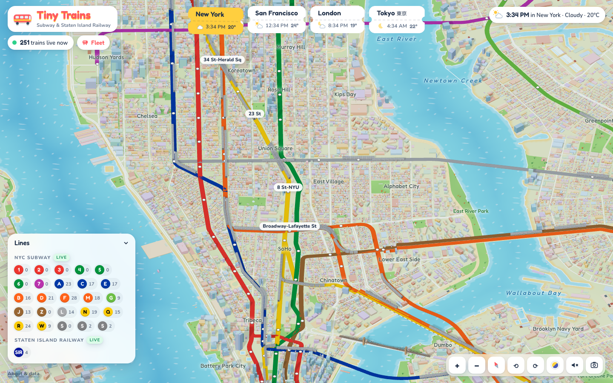
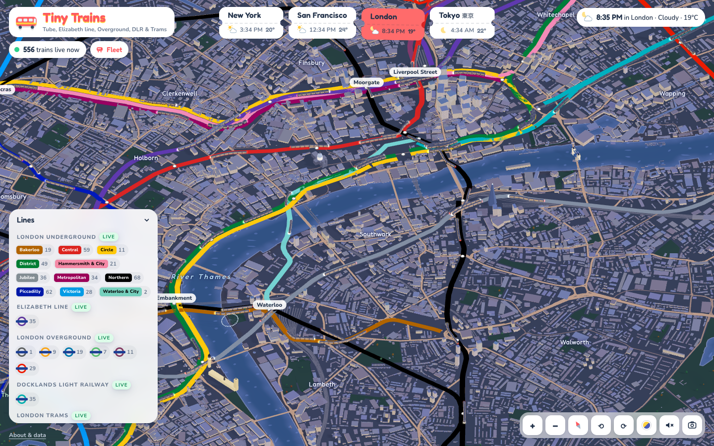
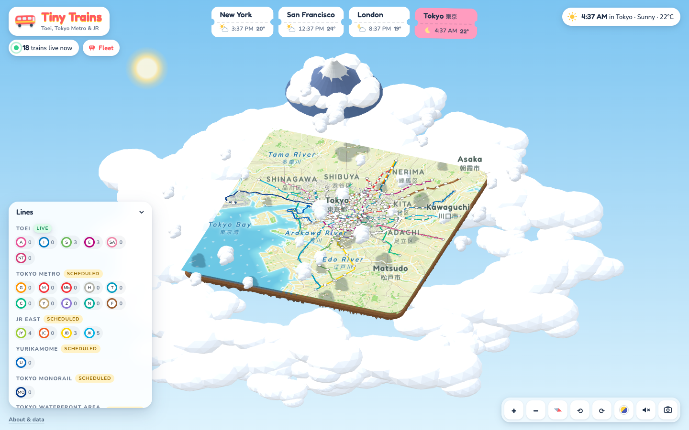
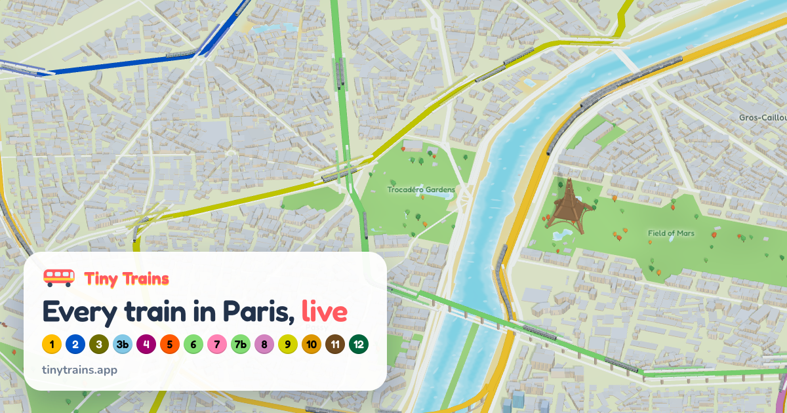

# Tiny Trains

**Live at [tinytrains.app](https://tinytrains.app)**

Every train in the world's great metro systems, live, on a tiny isometric toy map: New York, London, Paris,
Tokyo, Seoul, Hong Kong, Moscow, Singapore, Mexico City and more, 44 cities in all.

Each city is a little floating island in the clouds, built from real geography, with hand-built toy landmarks
(the Eiffel Tower, the Fernsehturm, Tower Bridge, the Star Ferries crossing Victoria Harbour). The trains are
real trains, placed from live feeds and animated along the actual track. Each one is a procedural model of its
real rolling stock (the R142 on the 2, the 1972 Stock on the Bakerloo, the MP 14 on Paris line 14, Berlin's
yellow U-Bahn), with its livery painted by hand in code. The sun, moon, stars and weather match each city right
now. At night the windows light up.

| | |
|---|---|
|  |  |
|  |  |

## Themes

The live data and the map are one model; how they're drawn is a theme. Pick one from the Theme menu under the logo (or press `V`),
or add `?theme=` to any link:

| | |
|---|---|
| **Toy** (`toy`) | Bright little dioramas floating in the clouds. The original. |
| **Clay** (`clay`) | An architect's white model: the city in plaster, only the lines and trains in color. |
| **Blueprint** (`blueprint`) | Drafted in white ink on engineer's blue: outlined buildings, a ruled grid, lines in colored pencil. |
| **NYC Subway** (`subway`) | The New York City Subway's signage: black signs with a thin white rule, Helvetica, route bullets, and a diagram-clean map with white-cased lines. |
| **Neon** (`neon`) | A synthwave night: lines and trains lit from within, the coast traced in pink, a soft bloom. |
| **Pixel** (`pixel`) | A 90s city-builder: SVGA pixels, grass tiles, asphalt roads with lane dashes, a black void and gray bevelled windows. |
| **Voxel** (`voxel`) | The whole city rebuilt in bright blocks, Minecraft Dungeons style: stepped coasts, block parks, cube houses and trees. Buildings keep their real angles; the ground's blocks grow as you zoom out. |
| **Monet** (`monet`) | An impressionist painting: brushstrokes that stay the same size at every zoom, lilac shadows, water-lily blues. |
| **Circuit** (`circuit`) | Inside the machine: a black circuit board of cyan traces, buildings as outlined chips, trains as packets of light. |
| **Noir** (`noir`) | A black-and-white city in hard light, where only the trains and their lines carry color. |
| **Cubism** (`cubism`) | The city broken into planes, in ochre, olive and slate, with dark outlines and cut-paper panels. |

A theme is a *look*, not a filter: every material (ground, water, roads, buildings, houses, trees, landmarks, lines,
trains) reads its palette and treatment from one set of shared uniforms (`src/themes/look.ts`), so the style is
applied where each thing is drawn and the information hierarchy survives: trains and lines keep their true colors,
and texture and linework fade to flat fills as you zoom out. A theme (`src/themes/themes.ts`) is those values plus
a sky and light, clouds, tree shape, a UI skin (`body[data-theme]` in `src/style.css`) and at most one gentle post
pass (`src/themes/post.ts`: neon's bloom, pixel's low-resolution grid). `scripts/dev/contact.ts` renders a
contact sheet of every theme at three zoom levels for checking a change.

## How it was made

Built in one Claude Code session by Claude (Opus 5.5) leading a team of background data agents. Every prompt and
every agent brief is in [docs/PROMPTS.md](docs/PROMPTS.md); the contract they worked to is
[docs/DATA_BRIEF.md](docs/DATA_BRIEF.md), and the shared city pipelines are documented in
[docs/KIT_GTFS.md](docs/KIT_GTFS.md) and [docs/KIT_SIM.md](docs/KIT_SIM.md).

## Run it

```bash
npm install
npm run dev          # API on :8787, app on http://localhost:5173
```

Production is Cloudflare: a front Worker serves the site, rewrites the OpenGraph tags per URL and edge-caches
`/api/<city>/trains`; each city has its own Worker + Durable Object that polls the feeds (`worker/`,
`wrangler.jsonc`, `worker/cities/*.jsonc`).

```bash
npm run deploy       # build + deploy every city Worker, then the front Worker
npx wrangler secret put TFL_APP_KEY -c worker/cities/london.jsonc   # London needs a (free) TfL key in production
```

A plain Node server works too: `npm run build && npm start` (serves dist/ and the API on :8787).

## Live data

| City | Realtime (no key needed) | Timetable-simulated | Unlock with a free key |
|---|---|---|---|
| New York | Subway + Staten Island Railway (MTA GTFS-realtime) | | |
| San Francisco | BART (GTFS-realtime + ETD train lengths) | Muni Metro, F-line, cable cars, Caltrain | `API_511_KEY` (511.org) makes Muni + Caltrain live |
| London | Tube, Elizabeth line, Overground, DLR, Trams (TfL Unified API) | | `TFL_APP_KEY` raises rate limits (needed on Cloudflare) |
| Paris | | Métro, RER, Tramway (IDFM GTFS) | `PRIM_KEY` (prim.iledefrance-mobilites.fr) makes all three live |
| Berlin | S-Bahn (VBB GTFS-realtime), Trams (VBB HAFAS radar) | U-Bahn (VBB's realtime feed has carried no U-Bahn trips since June 2026; switches to live on its own when it returns) | |
| Madrid | Cercanías (Renfe GTFS-realtime) | Metro, Metro Ligero (CRTM) | |
| Tokyo | Toei Subway, Arakawa tram, Nippori-Toneri Liner (ODPT public API) | Tokyo Metro, JR East, Yurikamome, Monorail, Rinkai | `ODPT_KEY` (developer.odpt.org) makes Tokyo Metro live |
| Seoul | | Seoul subway lines 1–9 and the Korail, AREX and light-rail lines | `SEOUL_API_KEY` (data.seoul.go.kr) makes them live |
| Hong Kong | MTR (Next Train API) | | |
| Philadelphia | SEPTA trolleys (T, G, D) and Regional Rail (GTFS-realtime, TrainView) | SEPTA Metro L, B and M, PATCO | |
| Budapest | | Metro, HÉV, trams, Cog-wheel Railway (BKK GTFS) | `BKK_KEY` (opendata.bkk.hu) makes them live |
| Milan | | Metro, S lines, trams (ATM and Trenord GTFS); S-line delays from ViaggiaTreno when it answers | |
| Rome | Tram 8 (Roma Servizi per la Mobilità GTFS-realtime) | Metro A, B/B1, C; Roma–Lido and Roma–Viterbo (simulated) | |
| Prague | Metro, trams, Esko (PID GTFS-realtime via Golemio) | Petřín funicular | |
| Naples | | Metro Lines 1, 2, 6 and 11, Circumvesuviana, Cumana, Circumflegrea, funiculars (ANM, EAV GTFS) | |
| Barcelona | FGC (GTFS-realtime), Rodalies (Renfe GTFS-realtime) | Metro, Trambaix/Trambesòs | |
| Lisbon | Trams and funiculars (Carris GTFS-realtime) | Metro, CP, Fertagus | |
| Istanbul | | Metro, Marmaray, trams, funiculars (simulated from Metro İstanbul's published departures) | |
| Montreal | | Métro, exo; the REM simulated from its published frequencies | |
| Dubai | | Metro, Tram (RTA GTFS), Palm Monorail (simulated) | |

Put keys in `.env` at the repo root for local runs, and in each city Worker's secrets for production
(`npx wrangler secret put PRIM_KEY -c worker/cities/paris.jsonc`, and so on):

```
API_511_KEY=...
ODPT_KEY=...
TFL_APP_KEY=...
PRIM_KEY=...
SEOUL_API_KEY=...
```

Trains marked **timetable** in the UI come from official timetables, used where no public live feed exists or
where a key isn't configured. Everything else is live.

Timetable data goes stale: rebuild Paris and Madrid (`npm run data:paris`, `npm run data:madrid`) monthly, and
Berlin (`npm run data:berlin`) before its feed ends on 12 Dec 2026. Until then they repeat their last good week.

## How it works

- `server/` polls each city's feeds only while someone is watching that city, then normalizes every
  train into a timeline: the previous stop plus upcoming stops, with estimated times
  (`shared/types.ts → TrainState`). Adapters live in `server/adapters/<city>/`.
- The client (`src/`, Three.js) animates each train along the real track geometry between timeline
  stops. Motion follows a speed-bounded, no-reversing model, so trains glide smoothly between polls.
  When ETAs slip, a train holds in place as if waiting at a signal.
- Rolling stock specs (`shared/stock/<city>.ts`) set each car's dimensions, doors, nose shape,
  cross-section profile (deep-tube round, box, bilevel, tram, monorail…) and livery. `src/engine/stockModel.ts`
  lofts the body and paints a livery atlas on a canvas, including lit windows for night.
- Geography (`public/data/<city>/geo.json`, `buildings.bin`, `density.bin`) is baked from OpenStreetMap vector
  tiles: water, parks, roads, rail, building footprints as oriented boxes, and a density raster that fills the
  suburbs with little houses.

### Rebuilding data

```bash
npm run data          # every city's transit network, then geography
npm run data:paris    # or one at a time: data:nyc, data:sf, data:london, data:berlin, data:madrid, data:tokyo, …
npm run check         # run each city's live adapters once and print sanity stats
```

## Links

Every selection has a URL you can share, and the Share button uses your phone's share sheet where there is one:

- `/tokyo` a city · `/tokyo/line/JY` a line, highlighted with all its trains
- `/nyc/station/635` a station and its departures
- `/nyc/line/L/train/<id>` ride along with one train (falls back to its line once it has finished its run)
- `/london/stock/london-1972` a kind of train: rides one that's running right now
- `#@lat,lon,span,azimuth` on any of them holds the camera

Each URL gets its own preview card (title, description and a poster of the city) when pasted into a chat.

## Controls

Drag to pan · scroll or pinch to zoom · right-drag (or two-finger twist) to rotate · click a train or station.

Keys: `1–9` cities · `C` city picker · `/` or `⌘K` search · `Q/E` rotate · `+/−` zoom · `F` follow (ride along) ·
`T` tour · `R` surprise train · `G` fleet guide · `L` sky (live / night / day) · `V` theme · `S` share · `P` save a postcard ·
`M` sound · `N` reset view · `Esc` close

On phones the panels become bottom sheets (drag up to expand, down to dismiss) and a dock holds Lines, Fleet,
Tour, Search and Share.

Things to try:

- **Tap a train** to see its real rolling stock spinning in 3D, where it is right now, and its next stops. A dashed
  ribbon traces the track ahead, and flags pop up over the next stations with live ETAs.
- **Follow** a train: the camera rides alongside it. Turn on sound (`M`) for a door chime at each station, in the
  spirit of each city.
- **Tap a station** for a departures board. Stations with several lines (Yoyogi: JY, JB and the Oedo line) show
  every line; tap one to filter and highlight it, then "See every … train" to focus the whole line.
- **Tap a line in the legend** to highlight it: its tracks stay bold, everything else fades, the camera frames
  the line and every train on it gets a pin, with a list of where each one is right now.
- **Search** (`/`) finds stations, lines, kinds of train and cities.
- **Tour** (`T`) drifts from train to train across the city; it starts by itself if you leave the map alone.
- **Sound** (`M`): announcements in each city's own language and style ("Stand clear of the closing doors",
  "Mind the gap", Japanese announcements and departure melodies in Tokyo, "Zurückbleiben, bitte!" in Berlin,
  Korean in Seoul, Cantonese in Hong Kong), plus the rumble of the ride. Melodies and phrasing are original;
  voices are your browser's built-in speech voices.
- **Fleet** (`G`) lists every kind of train running in the city right now, with a portrait and a fact for each.
- **Postcard** (`P`) saves the current view as a stamped postcard.
- Zoom out to see each city as a floating island. Tokyo is viewed from the east, like the classic skyline, with
  Fuji-san on the horizon; Hong Kong looks across Victoria Harbour from Kowloon.

## Credits and data licenses

The data files in `public/data/` and `server/data/` are derived from the sources below and stay under their licenses:
geography and many track shapes from OpenStreetMap (© OpenStreetMap contributors, ODbL), transit networks and
timetables from each operator's open data under its own terms.

Transit data: MTA, BART, SFMTA, Caltrain, Transport for London (Powered by TfL Open Data), Île-de-France
Mobilités, VBB / BVG / S-Bahn Berlin, CRTM and Renfe, ODPT (Public Transportation Open Data Center), Mini Tokyo
3D, Seoul Open Data Plaza and Korea's public data portal, MTR Corporation (DATA.GOV.HK). Map data ©
OpenStreetMap contributors, OpenMapTiles, OpenFreeMap. Weather: Open-Meteo.
